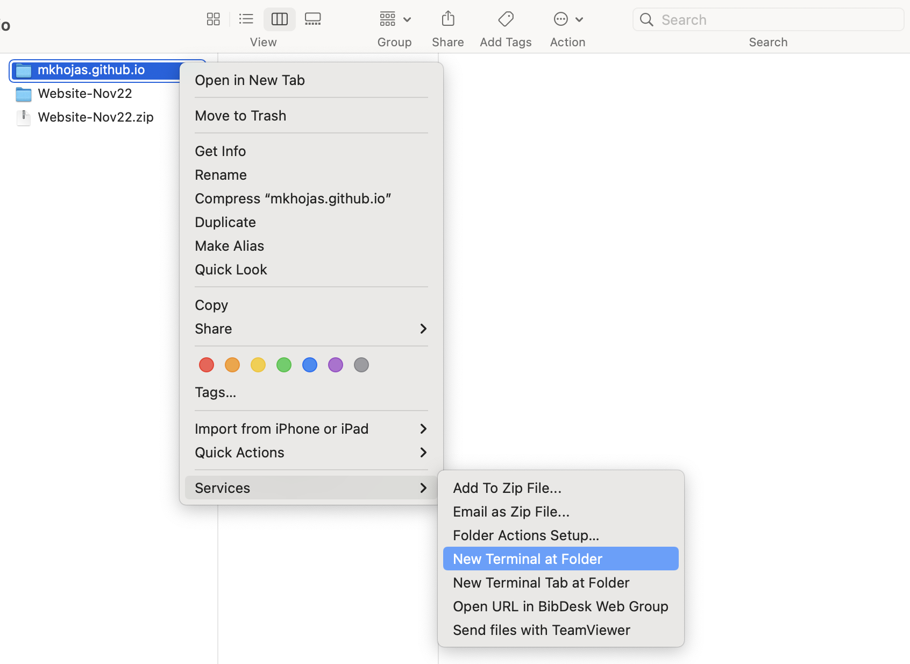

# My personal web page
This repository is the public web page for Dr. Mohammad Javad Khojasteh. 

# Getting the files in your local machine

To update your website first make sure you have cloned this repository on your local machine (e.g., your laptop) by running the following command: 

```
git clone https://github.com/mkhojas/mkhojas.github.io.git
``` 

If you have already cloned the repository in your local machine, you can skip this step. 

# Updating the website 

Now that you have all the files in your local machine, make any changes you wish and save your changes. 

After you finish all your changes to the files open a terminal at the root folder of the repository. You can do this on Mac by right clicking on your cloned repository folder and select `Terminal at folder` as shown in the following screenshot. 


In the terminal run the following commands: 
```
git add .
git commit -m "YOUR CUSTOM MESSAGE OR SUMMARY OF YOUR CHANGES"
git push origin main 
``` 

That's it! Wait a few minutes and check your website to see the new changes. 
